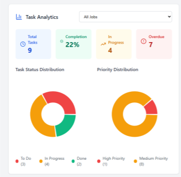
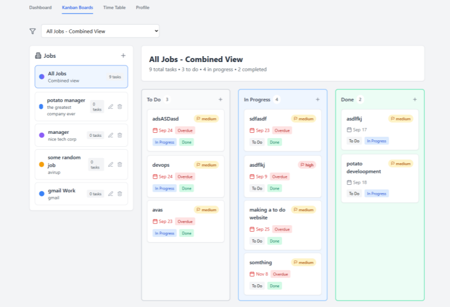
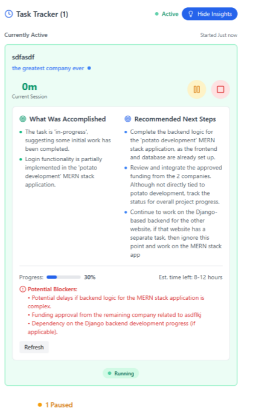
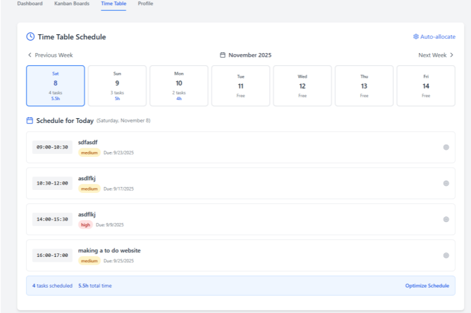

# 🤹 Role-Juggler

> **Task management software designed for remote workers with multiple job titles to effectively manage each role with ease.**

---

## 🌟 Overview

For remote workers managing multiple concurrent jobs or roles, keeping context clear and avoiding cross-role confusion is a constant struggle. **Role-Juggler** solves this by providing a unified task, time, and calendar management system tailored to separate, organize, and prioritize tasks distinctively by job/role, while offering intelligent AI insights to boost productivity.

---

## 🚀 Key Features

*   **💼 Multi-Role Workspace Management**
    *   Separate your workspaces by company and role (e.g., frontend developer, project manager, consultant).
    *   Apply distinct, harmonic color-coding to each job for instant visual distinction across all views.
*   **📋 Unified Kanban Board**
    *   A drag-and-drop board mapping task workflows (`To Do` ➔ `In Progress` ➔ `Done`).
    *   Combined cross-role view or filter by a specific role.
    *   Create tasks with rich attributes: deadline, priority, description, and job association.
*   **⏱️ Active Task Time Tracking**
    *   Interactive session tracker that enables starting, pausing, resuming, and completing sessions.
    *   Aggregates total time spent per task to provide precise work summaries.
*   **🗓️ Time Table / Calendar**
    *   A clean, interactive overview of tasks and deadlines to map out your weekly commitments across roles.
*   **🧠 AI-Powered Productivity Insights & Daily Summaries**
    *   **Task Insights:** Utilizes Google Gemini (`gemini-2.0-flash-lite`) to generate next steps, blockers, estimated time left, and progress based on task details and personal notes.
    *   **Daily Summaries:** Uses Gemini (`gemini-pro`) to evaluate completed tasks and active items, giving you a productivity score, custom daily summaries, and suggestions for tomorrow.
*   **📝 Interactive Sticky Notes**
    *   Color-coded quick-notes/scratchpads per workspace to capture sudden ideas or transient task details.
*   **✉️ Gmail Integration**
    *   Fetch daily updates directly from your connected work emails.
    *   Auto-detect meeting requests and action items from emails, feeding them directly into the system.

---

## 🛠️ Technology Stack

| Component | Technology | Description |
| :--- | :--- | :--- |
| **Frontend** | **React.js (v19)** | Modern SPA architecture with interactive hook states. |
| **Icons** | **Lucide React** | Sleek, modern outline icons. |
| **Visualization** | **Recharts** | Dynamic graphs for tracking task analytics and time-spent history. |
| **Backend** | **Django / Python** | Robust REST API powered by Django REST Framework (DRF). |
| **Database** | **SQLite3** | Lightweight local database for session tracking and user data. |
| **AI Layer** | **Google Gemini API** | Integration with generative models for intelligent workflow assistance. |

---

## 📂 Project Structure

```
Role-Juggler/
├── rolejuggler_backend/       # Django Backend API Project
│   ├── api/                   # Core App (endpoints, models, views, logic)
│   │   ├── models.py          # Database Schema (User, Job, Task, WorkSession, etc.)
│   │   ├── views.py           # API endpoints & integrations
│   │   └── urls.py            # API routing mapping
│   ├── rolejuggler_backend/   # Core Settings & Configuration
│   └── manage.py              # Django manager command utility
│
├── src/                       # React Frontend Project
│   ├── components/            # UI components (Kanban, TimeTable, Dashboard, Insights, Notes)
│   ├── contexts/              # Context Providers (AIInsightsContext, etc.)
│   ├── services/              # API connections and Gemini integrations
│   ├── App.js                 # Entry App Router / Main Page state manager
│   └── index.js               # React bootstrapper
```

---

## 🚀 Setup & Installation

### 1. Prerequisites
*   Node.js (v18+)
*   Python (v3.10+)
*   Google Gemini API Key (Optional, needed for AI features)

---

### 2. Backend Setup (Django)

1.  Navigate to the backend directory:
    ```bash
    cd rolejuggler_backend
    ```

2.  Create a Python virtual environment and activate it:
    *   **Windows (PowerShell):**
        ```powershell
        python -m venv venv
        .\venv\Scripts\Activate.ps1
        ```
    *   **macOS/Linux:**
        ```bash
        python -m venv venv
        source venv/bin/activate
        ```

3.  Install dependencies:
    ```bash
    pip install -r requirements.txt
    ```
    *(Note: If `requirements.txt` is missing, run: `pip install django djangorestframework django-cors-headers google-generative-ai requests axios`)*

4.  Apply database migrations:
    ```bash
    python manage.py migrate
    ```

5.  Create a superuser to access the Django Admin portal:
    ```bash
    python manage.py createsuperuser
    ```

6.  Run the backend server:
    ```bash
    python manage.py runserver
    ```
    *The API will be available at `http://localhost:8000/api/`.*

---

### 3. Frontend Setup (React)

1.  Navigate to the root directory of the project:
    ```bash
    cd ..
    ```

2.  Install npm dependencies:
    ```bash
    npm install
    ```

3.  Create a `.env` file in the root directory and add your Google Gemini API key:
    ```env
    REACT_APP_GEMINI_API_KEY=your_gemini_api_key_here
    ```

4.  Start the development server:
    ```bash
    npm start
    ```
    *The app will automatically open in your browser at `http://localhost:3000`.*

---

## 📸 App Screenshots

*Showcase of the Role-Juggler interface:*

| Analytics & Progress | Kanban Workspaces |
| :---: | :---: |
|  |  |

| AI Insights & Summary | Time Table Schedule |
| :---: | :---: |
|  |  |

> 💡 *Note: If you have screenshot images for these layouts, place them in the `/docs/screenshots/` folder matching the filenames above to render them in your repository.*

---

## ⚙️ Integrations Setup

### Gmail Integration
1. Go to your **Profile** tab in the dashboard.
2. Provide your **Gmail Address** and **App Password**.
3. (For safety, use a dedicated Google App Password generated via Google Account Security Settings).
4. Save profile settings to enable email scanning for task updates and meetings.

### Gemini AI Insights
Ensure the `REACT_APP_GEMINI_API_KEY` is set in your `.env` file. Once configured, you will receive real-time action suggestions, next steps, and productivity summaries directly in the dashboard and insights panels.
